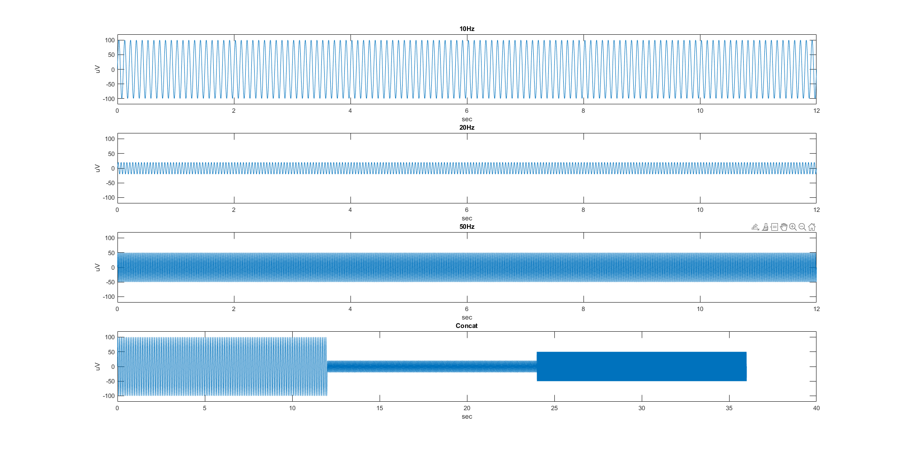
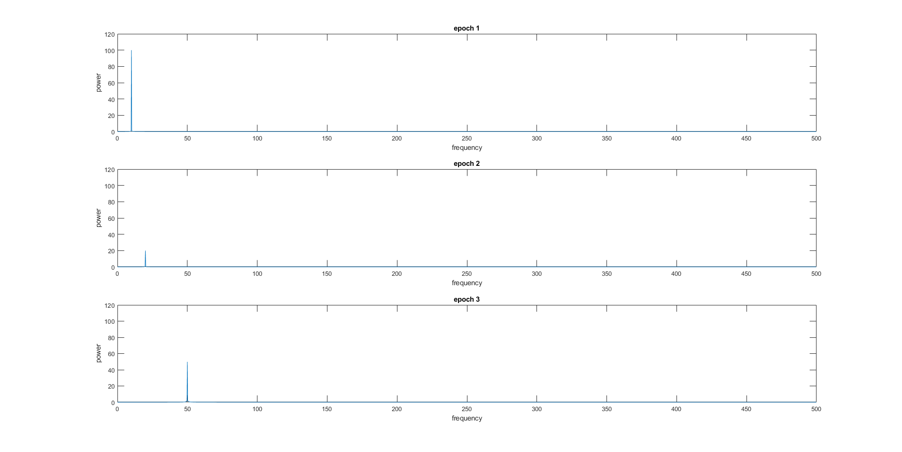

# fft_window
**Author: Ruei-Jyun Hung**
[](https://www.mathworks.com/matlabcentral/fileexchange/107589-fft_window)

This repository includes the code for the `fft_window.m` and `fft_hanningwindow.m` Matlab functions. The functions are intended to add a moving window while using fft.


## Usage

### Syntax
`[psd, f] = fft_window(data, t_start, t_end, channels, fs, window, shift);`

### Arguments

```matlab
data                      % Input data
t_start                   % starting time (sec) e.g. 0
t_end                     % ending time (sec) e.g. 26
channels                  % Number of signals e.g. 31
fs                        % Sampling frequency (Hz) e.g. 500
window                    % Length of window (sec) e.g. 4
shift                     % Overlapping e.g. 0.5
```


### Example
```matlab
%% 1. generate signals
% 10Hz
freq1 = 10;
t1 = linspace(0,12,12001);
y1 = sin(2*pi*freq1*t1)*100;
figure,
subplot(4,1,1),plot(t1, y1);
ylim([-120 120]);
xlabel('sec');
ylabel('uV');
title('10Hz');

% 20Hz
freq2 = 20;
y2 = sin(2*pi*freq2*t1)*20;
subplot(4,1,2),plot(t1, y2);
ylim([-120 120]);
xlabel('sec');
ylabel('uV');
title('20Hz');

% 50Hz
freq3 = 50;
y3 = sin(2*pi*freq3*t1)*50;
subplot(4,1,3),plot(t1, y3);
ylim([-120 120]);
xlabel('sec');
ylabel('uV');
title('50Hz');

%  concatenate signals
t2 = linspace(0,36,36001);
y4 = zeros(1, 36001);
y4(:, 1:12000) = y1(:, 1:12000);
y4(:, 12001:24000) = y2(:, 1:12000);
y4(:, 24001:36001) = y3(:, 1:12001);
subplot(4,1,4),plot(t2, y4);
ylim([-120 120]);
xlabel('sec');
ylabel('uV');
title('Concat');
```


```matlab
%% 2. fft_window
n_channel = 1;
Fs = 1000;
window = 4;
shift = 0.5;

% epoch1
[psd, f] = fft_window(y4, 0, 12, n_channel, Fs, window, shift); % fft analysis
figure, subplot(3, 1, 1), plot(f,psd);
ylim([0 120]);
xlabel('frequency');
ylabel('power');
title('epoch 1');

% epoch2
[psd, f] = fft_window(y4, 12, 24, n_channel, Fs, window, shift); % fft analysis
subplot(3, 1, 2), plot(f,psd);
ylim([0 120]);
xlabel('frequency');
ylabel('power');
title('epoch 2');

% epoch3
[psd, f] = fft_window(y4, 24, 36, n_channel, Fs, window, shift); % fft analysis
subplot(3, 1, 3), plot(f,psd);
ylim([0 120]);
xlabel('frequency');
ylabel('power');
title('epoch 3');
```



```matlab
%% 3. fft_hanningwindow
n_channel = 1;
Fs = 1000;
window = 4;
shift = 0.5;

% epoch1
[psd, f] = fft_hanningwindow(y4, 0, 12, n_channel, Fs, window, shift); % fft analysis
figure, subplot(3, 1, 1), plot(f,psd);
ylim([0 120]);
xlabel('frequency');
ylabel('power');
title('epoch 1');

% epoch2
[psd, f] = fft_hanningwindow(y4, 12, 24, n_channel, Fs, window, shift); % fft analysis
subplot(3, 1, 2), plot(f,psd);
ylim([0 120]);
xlabel('frequency');
ylabel('power');
title('epoch 2');

% epoch3
[psd, f] = fft_hanningwindow(y4, 24, 36, n_channel, Fs, window, shift); % fft analysis
subplot(3, 1, 3), plot(f,psd);
ylim([0 120]);
xlabel('frequency');
ylabel('power');
title('epoch 3');
```

